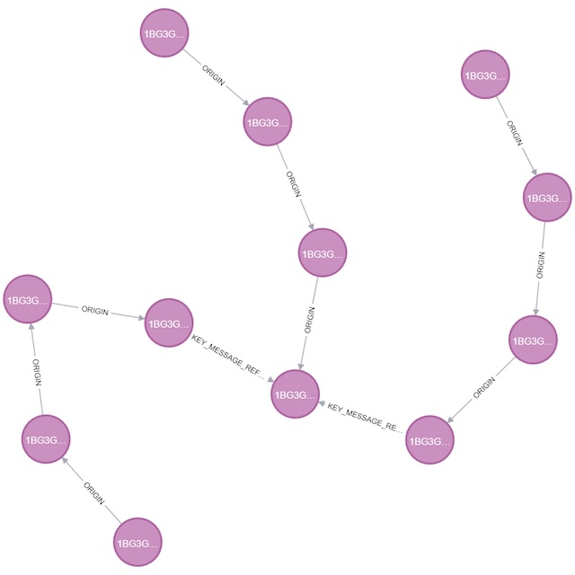
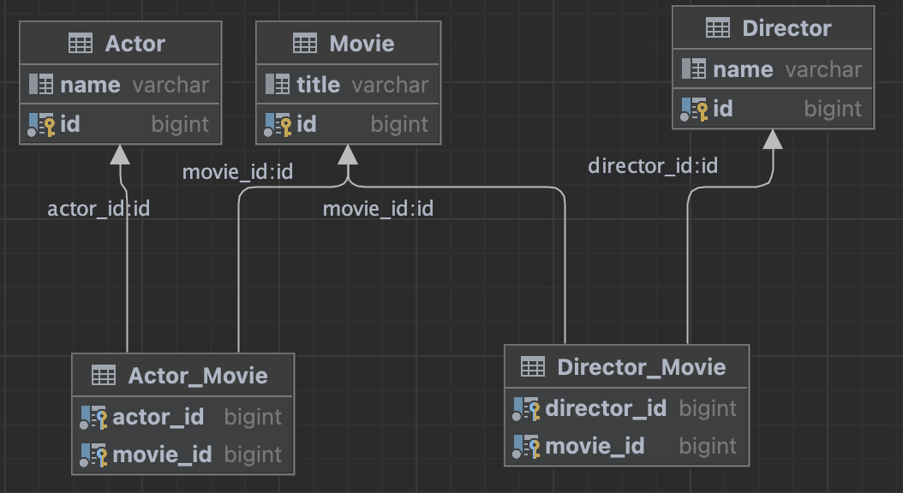

# Задание

- Придумать 2-3 варианта, когда применима графовая база данных. Можно даже абзац на контекст каждого примера.
- Воспользоваться моделью, данными и командами из лекции или одним из своих примеров из пункта 1 и реализовать аналог в любой выбранной БД (реляционной или нет - на выбор). Сравнить команды.
Написать, что удобнее было сделать в выбранной БД, а что в Neo4j и привести примеры.

## Придумать 2-3 варианта, когда применима графовая база данных. Можно даже абзац на контекст каждого примера.

Мы пробовали использовать Neo4J в следующих кейсах:
1) Построение системы мультимодальных перевозок для поиска оптимального маршрута перемещений из точки A в точку Б оптимизированного по одной из целевых функций (скорость, стоимость и тп) в качестве нод выступали топонимы, а в качестве связей - варианты перевозок. Сама реализация была успешной, но система работала слишком долго (около 2с на запрос), что не отвечало нефункциональным требованиям и мы отказались от Neo4J в пользу реализации своего алгоритма на C
2) Система хранения текущего статуса PNR авиабилета - принимает из системы бронирования EDIFACT телеграммы с информацией об изменении авиабилета и помещает их в граф, где телеграмма является нодой, а переход между телеграммами отражает процесс изменения PNR, при необходимости по PNR можно полностью поднять граф изменения его состояния во времени. Данная система хорошо себя показала и находится в эксплуатации. Прилагаю пример с картинкой 

## Воспользоваться моделью, данными и командами из лекции или одним из своих примеров из пункта 1 и реализовать аналог в любой выбранной БД (реляционной или нет - на выбор).

Попробуем реализовать простой аналог БД с фильмами из урока. Сделаем три таблицы и заполним их данными, а также еще 2 таблицы для связей между ними, схему получившейся БД прилагаю

Попробуем сделать простой запрос, например получить все фильмы где играет актер Leonardo DiCaprio и режиссером является Martin Scorsese

Сперва сделаем этот запрос в Графовой базе

match (d:Director {name: "Martin Scorsese"})
match (a:Actor {name: "Leonardo DiCaprio"})
match (m:Movie) - [r] - (a)
match (m) -[r] - (a)
return d,a,m

А затем этот же запрос в PostgreSQL:

select title, A.name, D.name
from "Movie" m
         join "Actor_Movie" am on m.id = am.movie_id
         join public."Actor" A on A.id = am.actor_id
         join public."Director_Movie" DM on am.movie_id = DM.movie_id
         join public."Director" D on D.id = DM.director_id

where A.name = 'Leonardo DiCaprio' and D.name = 'Martin Scorsese'

Как мы видим данный запрос гораздо сложнее предыдущего, хотя синтаксис PostgreSQL конечно гораздо привычнее