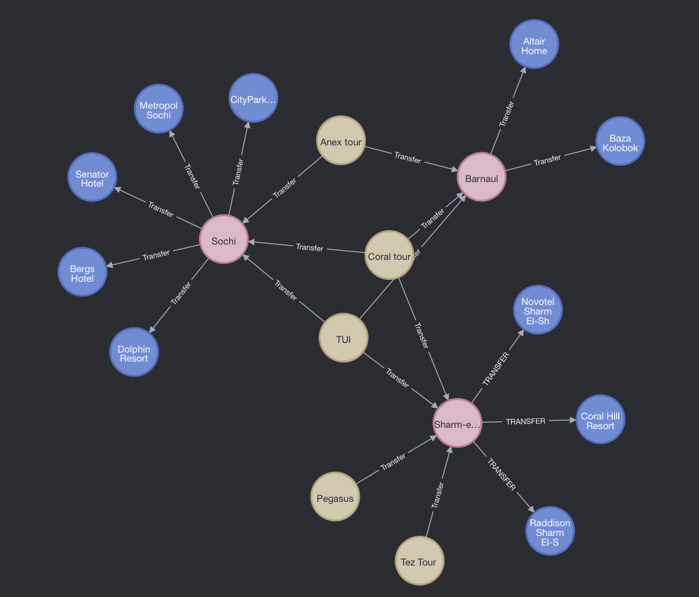
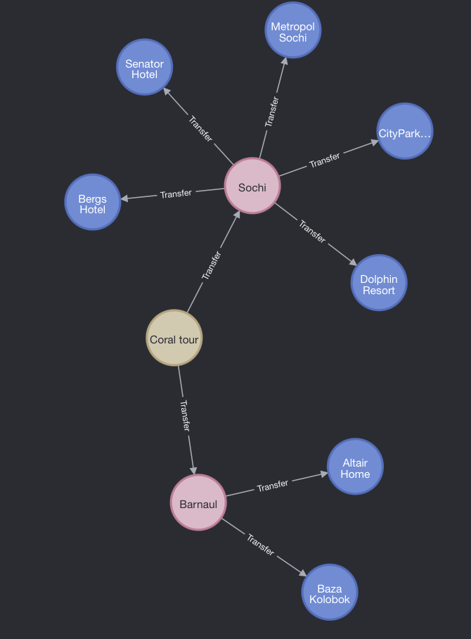
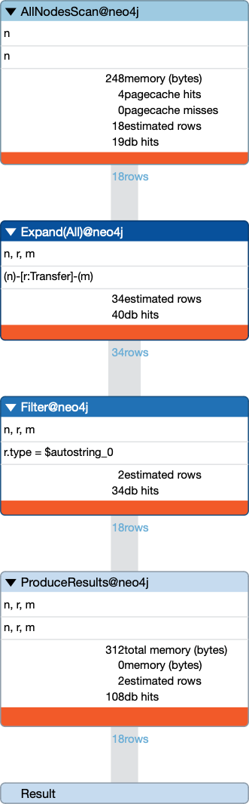
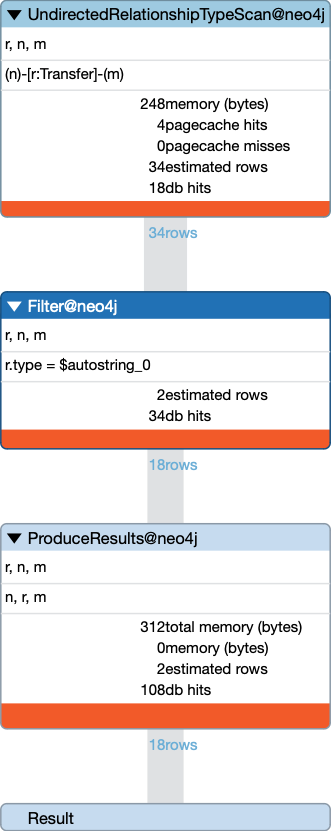

# Задание
- Взять 4-5 популярных туроператора.
- Каждый туроператор должен быть представлен в виде ноды neo4j
- Взять 10-15 направлений, в которые данные операторы предосавляют путевки.
- Представить направления в виде связки нод: страна - конкретное место
- Взять ближайшие к туриситческим локацимя города, в которых есть аэропорты или вокзалы и представить их в виде нод
- Представить маршруты между городми в виде связей. Каждый маршрут должен быть охарактеризован видом транспорта, который позволяет переместиться между точками.
- Написать запрос, который бы выводил направление (со всеми промежуточными точками), который можно осуществить только наземным транспортом.
- Составить план запроса из пункта 7.
- Добавить индексы для оптимизации запроса
- Еще раз посмотреть план запроса и убедиться, что индексыпозволили оптимизировать запрос

## Заполним БД требуемыми данными
```
create (TezTour:Operator {name:'Tez Tour'})
create (Pegasus:Operator {name:'Pegasus'})
create (Coral:Operator {name:'Coral tour'})
create (Anex:Operator {name:'Anex tour'})
create (TUI:Operator {name:'TUI'})

create (SharmElSheik:Toponym {name: 'Sharm-el-sheik'})
create (Barnaul:Toponym {name: 'Barnaul'})
create (Sochi:Toponym {name: 'Sochi'})

create (Raddisson:Resort {name: 'Raddison Sharm El-Sheik'})
create (CoralHill:Resort {name: 'Coral Hill Resort'})
create (Novotel:Resort {name: 'Novotel Sharm El-Sheik'})
create (Kolobok:Resort {name: 'Baza Kolobok'})
create (Altair:Resort {name: 'Altair Home'})
create (CityPark:Resort {name: 'CityParkHotel Sochi'})
create (Metropol:Resort {name: 'Metropol Sochi'})
create (Senator:Resort {name:'Senator Hotel'})
create (Bergs:Resort {name: 'Bergs Hotel'})
create (Dolphin:Resort {name: 'Dolphin Resort'})

create (SharmElSheik) -[:TRANSFER {type:'ground'}] ->(Raddisson)
create (SharmElSheik) -[:TRANSFER {type:'ground'}] ->(CoralHill)
create (SharmElSheik) -[:TRANSFER {type:'ground'}] ->(Novotel)
create (Barnaul) -[:Transfer {type:'ground'}] -> (Kolobok)
create (Barnaul) -[:Transfer {type:'ground'}] -> (Altair)
create (Sochi) -[:Transfer {type:'ground'}] -> (CityPark)
create (Sochi) -[:Transfer {type:'ground'}] -> (Metropol)
create (Sochi) -[:Transfer {type:'ground'}] -> (Senator)
create (Sochi) -[:Transfer {type:'ground'}] -> (Bergs)
create (Sochi) -[:Transfer {type:'ground'}] -> (Dolphin)

create (TezTour) -[:Transfer {type:'air'}] -> (SharmElSheik)
create (TUI) -[:Transfer {type:'air'}] -> (SharmElSheik)
create (Pegasus) -[:Transfer {type:'air'}] -> (SharmElSheik)
create (Coral) -[:Transfer {type:'air'}] -> (SharmElSheik)

create (Anex) -[:Transfer {type:'air'}] -> (Barnaul)
create (TUI) -[:Transfer {type:'air'}] -> (Barnaul)
create (Coral) -[:Transfer {type:'ground'}] -> (Barnaul)


create (Anex) -[:Transfer {type:'air'}] -> (Sochi)
create (TUI) -[:Transfer {type:'air'}] -> (Sochi)
create (Coral) -[:Transfer {type:'ground'}] -> (Sochi)
```

На данном этапе возникла небольшое непонимание, как именно нужно соединить города между собой, для построение маршрутов, я увидел следующие варианты:
- Соединить напрямую, например Barnaul - Sochi - довольно просто, но непонятно зачем тогда туроператоры
- Создать город отправления - например Moscow и соединять из него, например Moscow - Anex - SharmElSheik - конструкция выглядит довольно уродливо )
- Считать точкой отправления туроператора, например Anex - Sochi - считая, что место отправления и способ доставки туриста к стартовой точке маршрута решает или сам турист или туроператор - я в итоге выбрал этот вариант и получил следующий граф:



## Написать запрос, который бы выводил направление (со всеми промежуточными точками), который можно осуществить только наземным транспортом.

```
match (n) - [r:Transfer {type: 'ground'}] - (m)
return n,r,m
```
Запрос испольняется за 10ms
Данный запрос выведет граф доступных через наземный транспорт курортов



## Составить план запроса из пункта 7.

Составим план запроса
```
explain match (n) - [r:Transfer {type: 'ground'}] - (m)
return n,r,m
```


## Добавить индексы для оптимизации запроса

Добавим индекс на поле type связи Transfer
```
create index on for (r:Transfer) on r.type
```

## Еще раз посмотреть план запроса и убедиться, что индексыпозволили оптимизировать запрос

Смотрим на запрос




И видим, что полностью исчез шаг ExpandAll, что очевидно на большом объеме даст существенное преимущество