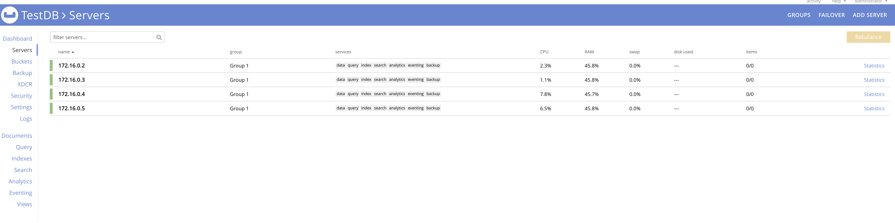
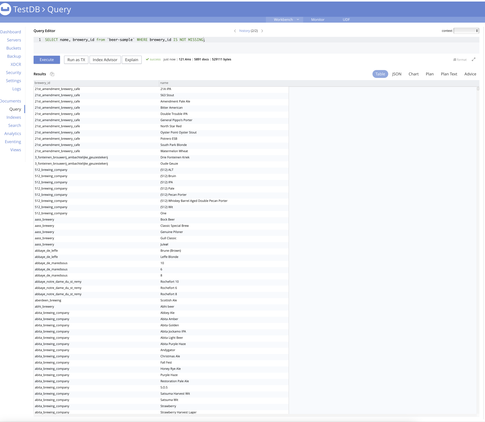
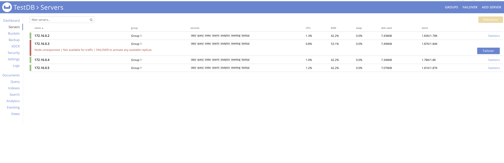
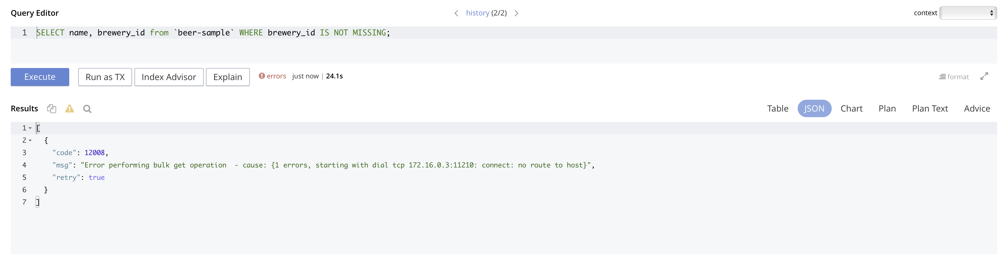
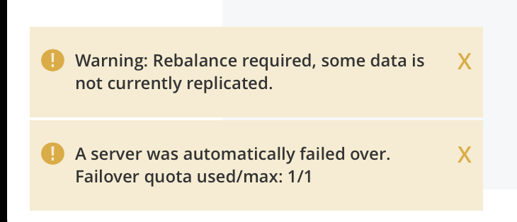
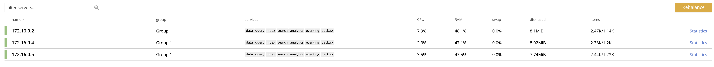
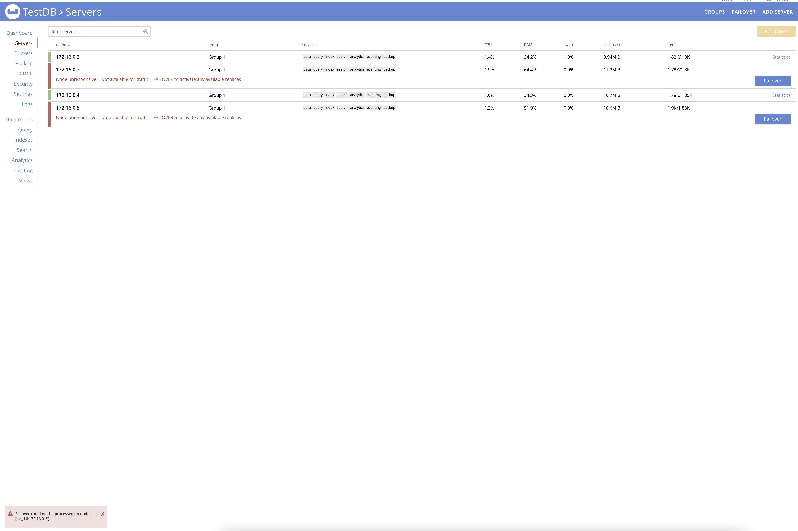

# Задание 

- Развернуть кластер Couchbase
- Создать БД, наполнить небольшими тестовыми данными
- Проверить отказоустойчивость

## Развернуть кластер Couchbase
Поднимаем ноды БД с помощью следующего docker-compose файла

```
version: '3.8'

networks:
  app-tier:
    driver: bridge
    ipam:
      config:
        - subnet: 172.16.0.0/24
          gateway: 172.16.0.1


services:
  couchbase1:
    image: 'couchbase:enterprise'
    container_name: couchbase1
    networks:
      app-tier:
        ipv4_address: 172.16.0.2
    ports:
      - 18091:18091

  couchbase2:
    image: 'couchbase:enterprise'
    container_name: couchbase2
    networks:
      app-tier:
        ipv4_address: 172.16.0.3
  
  couchbase3:
    image: 'couchbase:enterprise'
    container_name: couchbase3
    networks:
      app-tier:
        ipv4_address: 172.16.0.4
  

  couchbase4:
    image: 'couchbase:enterprise'
    container_name: couchbase4
    networks:
      app-tier:
        ipv4_address: 172.16.0.5
    
```

Заходим через браузер на адрес localhost:18091 и производим первоначальную настройку кластера, в поле IP адреса указываем постоянный адрес контейнера - 172.16.0.2

После завершения настройки заходим во вкладку Servers и добавляем остальные 3 ноды с параметрами по умолчанию. После добавления нажимаем rebalance для распределения данных на новые ноды



## Создать БД, наполнить небольшими тестовыми данными

Переходим на вкладку Buckets->sample bucket-> beer-sample -> Load Sample Data

После загрузки перейдем во вкладку Query и сделаем простой запрос




## Проверить отказоустойчивость

попробуем остановить один из контейнеров



Сервер перейдет в нерабочее состояние, запросы при этом выполнятся перестанут



Однако в течении нескольких минут, пока я оформлял данный документ система автоматически восстановила работоспособность



Осталось только нажать кнопку rebalance для обеспечения отказоустойчивости



Попробовав вывести из строя 2 ноды приходим к выводу, что восстановление невозможно и кластер поврежден необратимо



Кластер возможно восстановить только после возврата в строй любой из нод